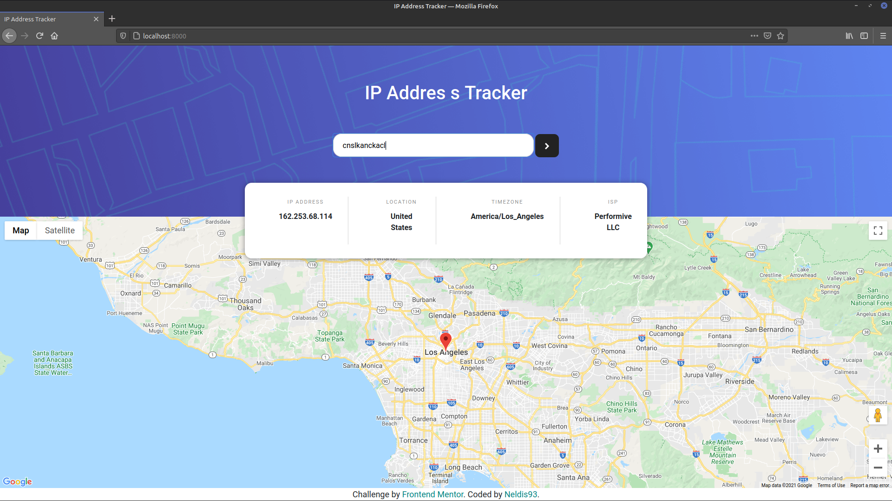
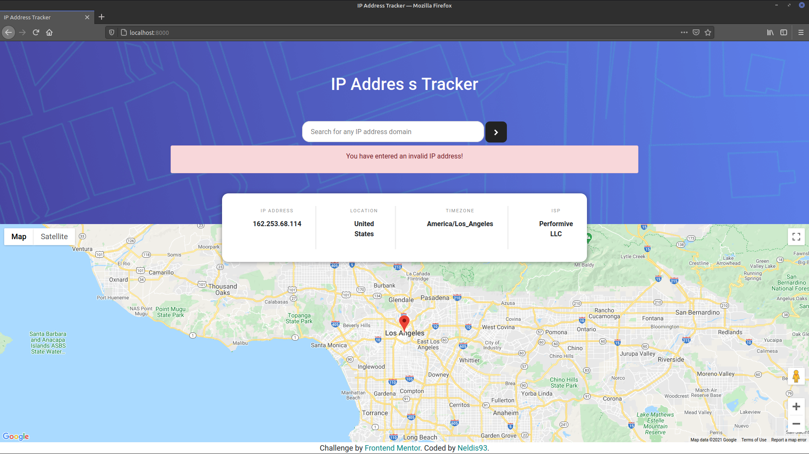
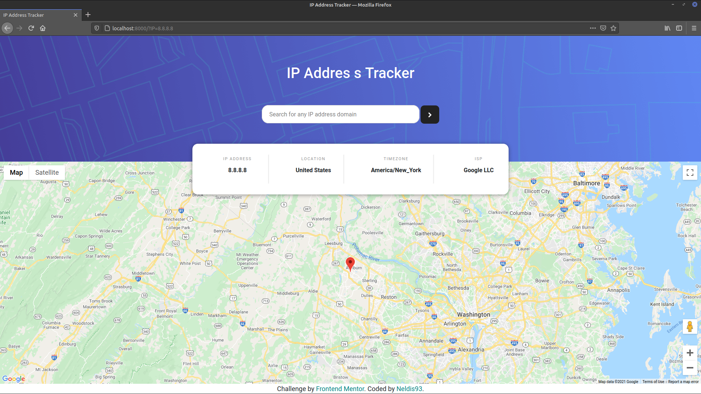

# Frontend Mentor - IP Address Tracker :computer:

# Description

 IP address tracker app to get IP address locations with a geolocation API and display a map with the location.
 
 This challenge is from [Frontend Mentor](https://www.frontendmentor.io/challenges/ip-address-tracker-I8-0yYAH0)
 
 # ⚡ Used Technologies
- Python
- Django and Django rest-framework
- CSS
- Bootstrap 4 
- API Geolocation [This API](https://ip-api.com/docs/api:json)
- API to display the map *API Google Map* with Google Cloud Platform
 
# Some images of the project :camera: 

#

## if you enter a wrong IP address or string values it will show an error.

#

